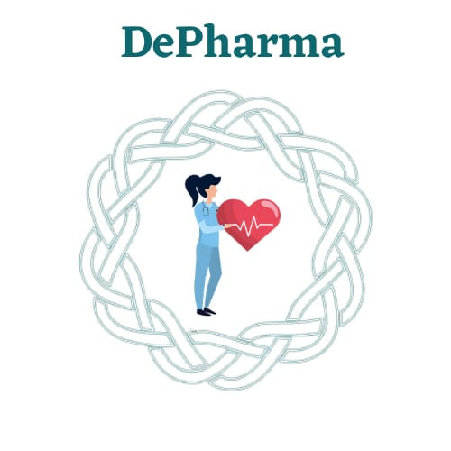

# DePharma-ETHGlobal
DePharma ecosystem for providing, scheduling and processing vaccines and drugs.

# Project Name  = ***DePharma***

## What we're building - 

DePharma is an ecosystem which lets you do -

1. Book vaccine - A decentralised event for scheduling and booking of vaccine with a payment powered by Unlock Blockchain.
2. Consult a doc - With decentralised storage system like IPFS and Live peer, interact with doctor and be the owner of your documents solely. After the successful prescription, you can buy the prescribed drugs from the platform.
3. Buy the essential healthcare equipments - Marketplace to buy the essential equipments like  [Masks, Face shield, Gloves, etc.]

## Tools and technologies used - 

1. [Unlock Protocol](https://unlock-protocol.com/)
2. [POAP - The Proof of Attendance Protocol](https://www.poap.xyz/)
3. [LivePeer](https://livepeer.org/)
4. [Pinata](https://pinata.cloud/)
5. Gatsby
6. React js
7. Node/ Express

## Team -

1. [Pranshu Rastogi](https://github.com/pranshurastogi)
2. [Manul Singh Parihar](https://github.com/JeremyConnor)
3. [Ishita Rastogi](https://github.com/ishitarastogi)
