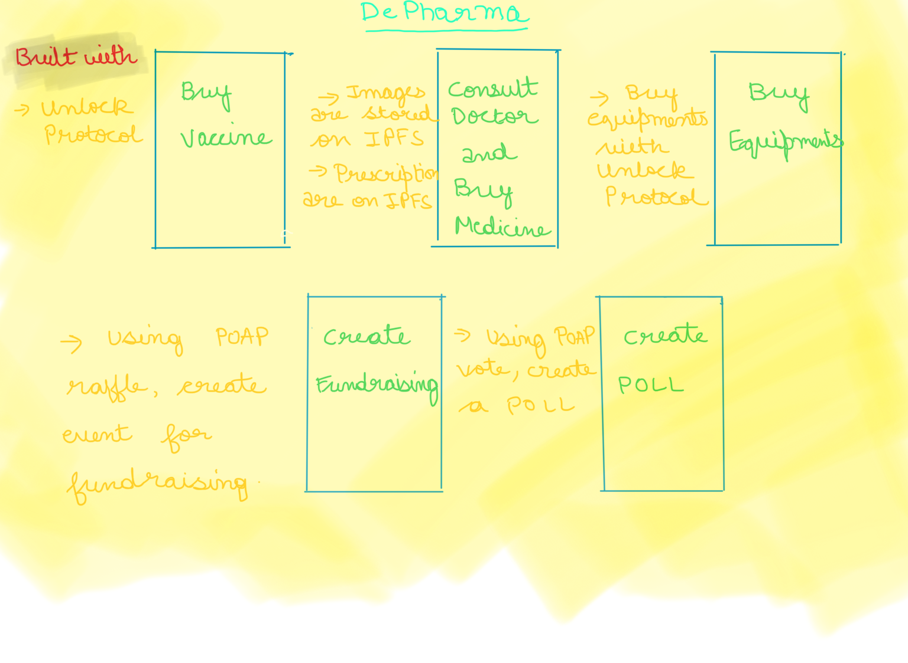

# DePharma-ETHGlobal
DePharma is an ecosystem for providing, scheduling and processing vaccines, drugs and medical devices.

# Project Name  : ***DePharma***

## What we're building - 

DePharma is an ecosystem with the following features -

1. Vaccine store- Buy vaccine using unlock protocol.
2. Consult a doc - With decentralised storage system like IPFS and Live peer, interact with doctor and be the owner of your documents solely. After the successful prescription, you can buy the prescribed drugs from the platform.
3. Buy the essential healthcare equipments - Marketplace to buy the essential equipments like  [Masks, Face shield, Gloves, etc.]
4. Fundraising raffle - Create raffle fundraising event with POAP.
5. Create POLL - Create a Poll with POAP.

## Future of this project - 

-> We're trying to build event based registeration of vaccine by providing unique NFT to every user once he/she gets vaccinated. With POAP itself being under development, we can collaborate with it in near future to implement the exposable APIs and thus create healthcare related community polls and start fundraiser events for charity.

-> Integrting the platform with livepeer for users to go on a one-to-one consultation with a doctor. The user will also hold the sole access rights of viewing and transferring his documents and videos [Will be enabled from smart contract].

-> Onboarding of users and providing authentic news regulated by the validators.

## Tools and technologies used - 

1. [Unlock Protocol](https://unlock-protocol.com/)
2. [POAP - The Proof of Attendance Protocol](https://www.poap.xyz/)
3. [Pinata](https://pinata.cloud/)
4. Gatsby
5. React js
6. Node/ Express

## Team -

1. [Pranshu Rastogi](https://github.com/pranshurastogi)
2. [Manul Singh Parihar](https://github.com/JeremyConnor)
3. [Ishita Rastogi](https://github.com/ishitarastogi)
